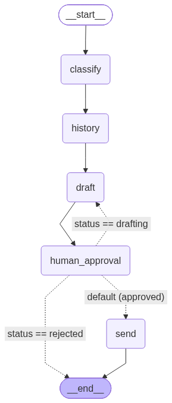

# Review Gate

Review Gate is an AI-assisted support workflow. It classifies support tickets, builds a reply draft using internal knowledge, and then waits for human approval (approve/reject/edit/manual edit) before sending the final response.

## What it does

- Classifies incoming ticket (`category`, `priority`)
- Loads customer history
- Searches internal knowledge base (RAG over `src/data/raw/*.md`)
- Generates a draft reply
- Pauses for human decision
- Sends final approved reply

## Requirements

- Python `>=3.13`
- [uv](https://docs.astral.sh/uv/) (recommended)
- `OPENAI_API_KEY`

## Environment setup

1. Create `.env` in project root:

```env
OPENAI_API_KEY=your_openai_api_key
LANGSMITH_TRACING=true
LANGSMITH_ENDPOINT=https://aws.api.smith.langchain.com
LANGCHAIN_API_KEY=your_langsmith_key
LANGSMITH_PROJECT=review-gate
```

2. Install dependencies:

```bash
uv sync
```

3. (First run or when knowledge files change) ingest knowledge base:

```bash
uv run ingest-knowledge
```

## Run app (CLI flow)

Runs the local interactive review loop from `main.py`.

```bash
uv run main.py
```

## Run API

Starts FastAPI on `http://127.0.0.1:8000` with reload.

```bash
uv run api
```

Swagger docs:

- `http://127.0.0.1:8000/docs`
- `http://127.0.0.1:8000/redoc`

## API endpoints

| Method | Path | Description |
| --- | --- | --- |
| `GET` | `/health` | Health check |
| `POST` | `/tickets` | Create ticket and start review flow |
| `GET` | `/tickets` | List tickets (optionally filter by `customer_id` or `status`) |
| `GET` | `/tickets/{ticket_id}` | Get single ticket by ID |
| `POST` | `/tickets/{ticket_id}/decision` | Submit human decision: `approve`, `reject`, `edit`, `manual_edit` |

### `POST /tickets` request body

```json
{
  "ticket": "Nie mogę zalogować się do panelu. Dostaję błąd 403.",
  "customer_id": "cust_001"
}
```

### `POST /tickets/{ticket_id}/decision` request body

```json
{
  "action": "edit",
  "feedback": "Dodaj pytanie o godzinę wystąpienia błędu i przeglądarkę."
}
```

## Architecture graph placeholder




## Demo url

[Demo URL](https://youtu.be/puctC-PEicY)
